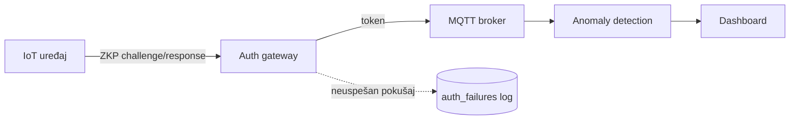

# Smart Home Security Platform

Simulacija IoT mreže pametnog doma sa autentikacijom uređaja zasnovanom na Zero-Knowledge Proof (Schnorr) protokolu, ML detekcijom anomalija i live dashboard-om. Diplomski rad iz predmeta *Internet of Things*.

## O projektu

Klasična IoT autentikacija (lozinke, statički API ključevi) zahteva da uređaj otkrije svoju tajnu pri svakoj konekciji, što je rizično u slučaju presretanja saobraćaja. Ovaj projekat implementira Schnorr zero-knowledge proof protokol: uređaj dokazuje da poseduje privatni ključ, a da ga nikad ne pošalje preko mreže. Pored autentikacije, sistem prati i senzorske podatke u realnom vremenu i detektuje sumnjivo ponašanje preko Isolation Forest modela.

## Arhitektura



## Status

- [x] Faza 1: Mosquitto broker + simulirani IoT uređaji
- [x] Faza 2: ZKP (Schnorr) autentikacija preko auth gateway-a
- [x] Faza 3: Anomaly detection (senzorski podaci + neuspeli auth pokušaji)
- [x] Faza 4: Live dashboard
- [x] Faza 5: Testiranje napada i evaluacija

Faza 2.5 (Mosquitto sam validira token na transportnom nivou) je bila deo originalnog plana, ali je svesno izostavljena iz obima rada. Razlog i detalji u sekciji "Poznata ograničenja".

## Tehnologije

| Komponenta | Tehnologija |
|---|---|
| Simulirani uređaji | Python, `paho-mqtt` |
| ZKP autentikacija | Python, Schnorr protokol (implementacija od nule) |
| Auth gateway | FastAPI, SQLite |
| MQTT broker | Eclipse Mosquitto |
| Anomaly detection | scikit-learn (Isolation Forest) |
| Dashboard | Flask, vanilla JS + inline SVG, bez eksternih CDN zavisnosti |
| Infrastruktura | Docker Compose |

## Preduslovi

- Python 3.10+
- Docker i Docker Compose
- (opcionalno) `mosquitto-clients` za ručnu proveru MQTT poruka preko terminala

## Pokretanje

Sve komande se pokreću iz root foldera projekta, sa `-m` oznakom (npr. `python -m devices.device_simulator`), zbog deljenih paketa koji se međusobno importuju.

```bash
pip install -r requirements.txt
docker compose up -d
```

U zasebnim terminalima, redom:

```bash
# Auth gateway
uvicorn gateway.main:app --reload --port 8000

# Anomaly monitor (modeli su već istrenirani i uključeni u repo)
python -m anomaly.live_monitor

# Dashboard
python -m dashboard.app
```

Otvori `http://localhost:5000` u browseru.

Registracija i pokretanje uređaja:

```bash
python -m devices.register_device --device-id sensor-temp-01
python -m devices.secure_device_simulator --device-id sensor-temp-01 --sensor-type temperature
```

Za brzi test bez ZKP-a (samo MQTT, korisno za prvu proveru da broker radi):

```bash
python -m devices.device_simulator --device-id sensor-temp-01 --sensor-type temperature
```

Simulacija napada (treba da se vidi na dashboard-u i u logu monitora):

```bash
python -m anomaly.attack_simulator --device-id sensor-temp-01 --sensor-type temperature --value 90.0
```

## Testiranje i evaluacija

```bash
pytest tests/ -v
```

Pokreće 11 testova: kriptografski modul (`test_schnorr.py`), anomaly detection (`test_anomaly.py`) i napadi na gateway preko FastAPI TestClient-a (`test_gateway_attacks.py`).

```bash
python -m evaluation.run_evaluation
```

Generiše `docs/rezultati_evaluacije.md` sa stvarnim, reproduktivnim brojevima (ZKP performanse, stopa lažnih pozitiva, osetljivost detekcije, otpornost na spoofing).

| Napad | Kako se testira | Gde |
|---|---|---|
| Spoofing (lažan privatni ključ) | 100 pokušaja sa nasumičnim ključem | `evaluation/`, `tests/test_gateway_attacks.py` |
| Replay (presretnut odgovor) | Stari response na nov challenge | `tests/test_gateway_attacks.py` |
| Brute-force | 4+ neuspela pokušaja zaredom | `tests/test_gateway_attacks.py` |
| Nonce reuse | Matematičko izvlačenje privatnog ključa | `tests/test_schnorr.py` |
| Anomalni senzorski podaci | Skokovi različitih veličina (±1 do ±32) | `evaluation/run_evaluation.py` |

Stopa lažnih pozitiva se meri na odvojenom test skupu (drugačiji random seed od trening skupa), da se izbegne data leakage.

## Poznata ograničenja i budući rad

- Mosquitto broker trenutno ne validira token na transportnom nivou (`allow_anonymous true`). Gateway izdaje token samo nakon uspešnog ZKP dokaza, ali bi prava defense-in-depth arhitektura zahtevala da i sam broker proverava token, npr. preko `password_file` ili dynamic security plugin-a.
- ZKP protokol je interaktivan (challenge/response u dva HTTP poziva). Non-interactive varijanta preko Fiat-Shamir heuristike bi smanjila network overhead.
- Izdati JWT tokeni važe do isteka (5 min), bez mehanizma za prevremeno opozivanje kompromitovanog uređaja.
- Anomaly detection koristi samo dva feature-a (vrednost i devijaciju od rolling medijane). Bogatiji feature set, npr. sezonalnost ili korelacija između senzora, bi dalje smanjio stopu lažnih pozitiva.

## Struktura projekta

```
smart-home-security-platform/
├── crypto/          # Schnorr ZKP protokol (deli ga gateway i uređaji)
├── devices/         # simulacija IoT uređaja, ZKP klijent, deljena sensors.py logika
├── gateway/         # auth gateway (FastAPI) + registar uređaja + auth_failures log (SQLite)
├── anomaly/         # Isolation Forest modeli, live monitor, attack simulator
├── dashboard/       # Flask live dashboard (MQTT listener + JSON API + frontend)
├── evaluation/      # evaluacija performansi i bezbednosti
├── broker/          # Mosquitto konfiguracija
├── tests/           # testovi kriptografije, anomaly detection i napada na gateway
├── docs/            # dokumentacija, rezultati_evaluacije.md
├── docker-compose.yml
└── requirements.txt
```

## Literatura

- Lightweight zero-knowledge authentication scheme for IoT embedded devices (LZIA)
- TinyZKP: Non-interactive zero knowledge proofs for IoT device authentication
- BANZKP: lightweight authentication scheme for body area networks
- SEAS: Secure and Efficient Authentication Scheme for Large-Scale IoT Devices Based on Zero-Knowledge Proof
